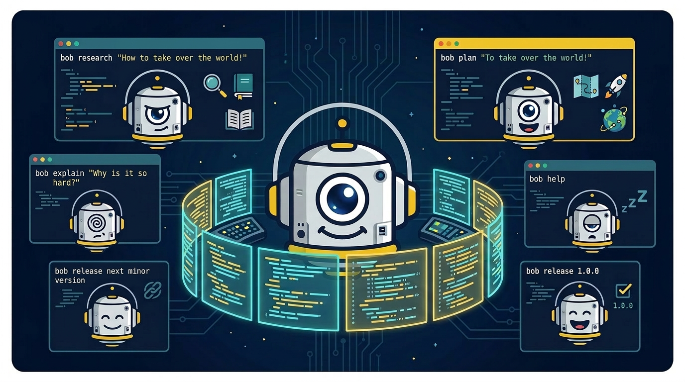

  

  
  

  <em>An orchestration tool for agentic coding — research, spec, plan, code, test, review and learn.</em>

  <a href="#quick-start">Quick Start</a> •
  <a href="#commands">Commands</a> •
  <a href="docs/development/architecture.md">Architecture</a> •
  <a href="docs/user/README.md">User Guide</a> •
  <a href="CHANGELOG.md">Changelog</a>

## Quick Start

## Commands

| Command | Description |
|---------|-------------|
| `bob setup` | Configure bob settings (interactive, rerunnable) |
| `bob research <issue-id>` | Research a topic and produce a report |
| `bob update` | Update bob (includes config migration) |
| `bob help [topic]` | Show help for commands, skills, or agents |
| `bob explain <text>` | Explain project artifacts |
| `bob doctor` | Validate environment and directory structure |

## How It Works

Configuration lives in [`.agents/bob.config.json`](.agents/bob.config.json). Run `bob setup` to configure interactively.

### Model Configuration

Bob supports multiple AI models organized into tiers (premium, standard, fast). Configure model assignments per agent in `.agents/bob.config.json`. See [Model Assignment](docs/user/model-assignment.md) for details on tier selection, resolution order, and cost management.

## Documentation

| Guide | Covers |
|-------|--------|
| [User Guide](docs/user/README.md) | Installation, commands, workflows, configuration, troubleshooting |
| [Development Guide](docs/development/README.md) | Architecture, project structure, contributing, toolchain |
| [Security](docs/security/README.md) | Threat model, scanning, security policies |

## Inspiration & Resources

The name **bob** comes from Dennis E. Taylor's [Bobiverse](https://www.goodreads.com/series/192752-bobiverse) series — a software engineer who gets uploaded as an AI and starts replicating. If you're into code, space, and existential humor, you'll love the books.

For agentic coding, Kjetil Eik's work on [knots](https://github.com/kjetileik) kicked off the exploration for how these tools could work — and work great — considering the limitations of LLMs. Communication style inspired by [caveman-micro](https://github.com/kuba-guzik/caveman-micro) (MIT).

- [agents.md](https://agents.md/) — Standard for agent definitions
- [agentskills.io](https://agentskills.io/) — Standard for skill definitions
- [Universal Agents Control Manifest](https://github.com/leochiu-a/universal-agents/blob/main/AGENTS.md)
- [Conventional Commits](https://www.conventionalcommits.org/en/v1.0.0/)
- Matt Pocock's "AI Engineering Workshop 2026":  
  - [ai-engineer-workshop-2026 | repo](https://github.com/mattpocock/ai-engineer-workshop-2026-project)
  - [Full walkthrough | youtube](https://www.youtube.com/watch?v=-QFHIoCo-Ko)
